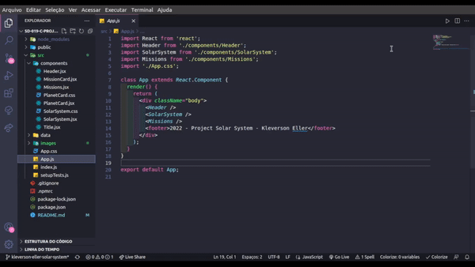
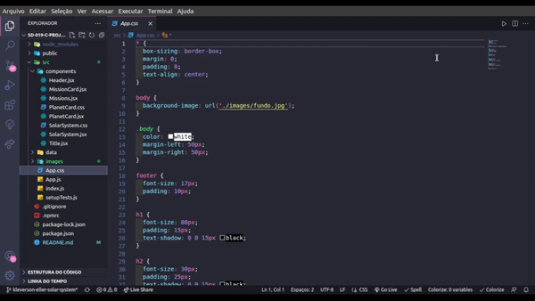

# Projeto Solar System

# Contexto
Este projeto trata-se de um catalogo que mostra os planetas do nosso sistema solar e algumas das missões ja feitas para o espaço pela humanidade.

Esse projeto foi feito como validação do bloco de `Introdução à React` no modulo de `Front-End` da `Trybe`.

A aplicação tem como objetivo o aprendizado do conceito de componentes no React.
<br>

### Código



### CSS



### Pagina


<br>

## Técnologias usadas

Front-end:
> Desenvolvido usando: React, CSS3, JavaScript ES6.

## Instalando Dependências

``` bash
npm install
``` 
## Executando aplicação

  ``` bash
  npm start
  ```
